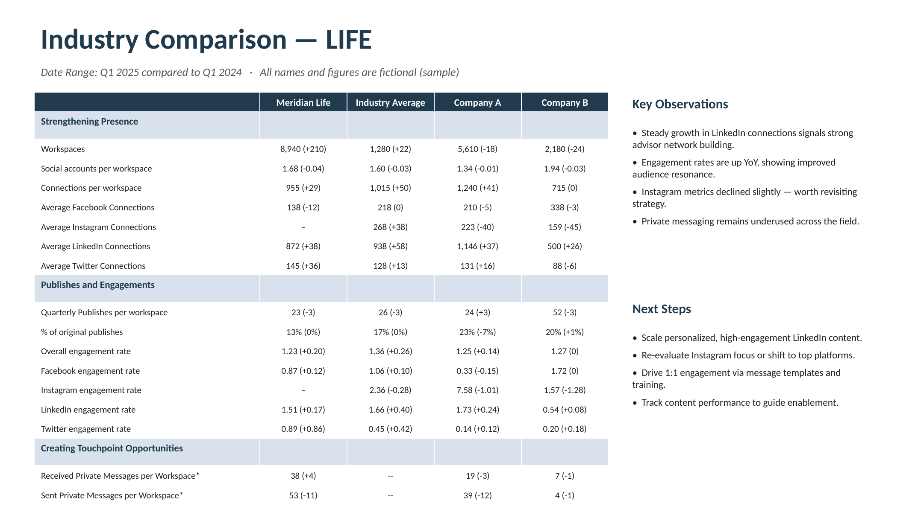

# The Source Spreadsheet & the Manual Process

This page shows how the EBR industry comparison was produced **by hand** from the Industry Magic workbook, before any automation. It's here to tell the "how it used to work" story. A sanitized sample workbook and a sample output slide accompany it.

> Everything here uses **fictional companies and numbers**. The real workbook contains customer data and is not included.

## Sample files in this repo

- **[`reference/Industry-Magic-SAMPLE.xlsx`](../reference/Industry-Magic-SAMPLE.xlsx)** — a stripped-down copy of the workbook with fake data, reproducing the three working tabs plus the dropdown lists.
- **`reference/industry-comparison-sample.png`** — a rebuilt example of the finished slide (below).

## How the workbook is laid out

The real workbook has six tabs; the sample reproduces the ones you actually touch:

| Tab | In sample? | Role |
|-----|:---:|------|
| **Operations** | ✅ | Control panel. A selection panel (Industry, Year, Quarter, Comparison Type, Main Org, Company A, Company B) sits above a metric grid. Each metric row has a `Show?` TRUE/FALSE flag and eight value columns — current + prior quarter for each of the four entities. |
| **Report - Change Incl** | ✅ | Reads the Operations grid and assembles the presentation table **with** period-over-period deltas, e.g. `1600 (+90)`. Only rows flagged TRUE appear. |
| **Report - No Change** | ✅ | Same table, values only, no deltas. |
| **Operation Lists** | ✅ (sample lists) | Backing dropdown lists (industries, years, quarters, comparison types, orgs). |
| **Org Lists** | ❌ | Master customer roster — omitted (real customer data). |
| **References** | ❌ | Per-quarter source-workbook lookup — omitted (contains links + notes). |

### How the delta strings are built

In the sample, the **Operations** tab holds the raw numbers as inputs (shown in blue), and the **Report** tabs are driven by formulas that reference them — so changing an input updates the report automatically. For example, a report cell is roughly:

```
=Operations!C12 & " (" & IF(delta=0,"0", IF(delta>0,"+"&delta, delta)) & ")"
```

which turns a current value of `1600` and a prior value of `1510` into the string **`1600 (+90)`**. Percentages append `%`; engagement rates format to two decimals. This mirrors how the live sheet assembles each cell from hidden helper columns.

## The manual EBR process (how it was done by hand)

1. **Refresh the data.** Each quarter, raw per-account exports (per-workspace breakdown, publishing/posts data, social-account directory) were pulled for the industry, aggregated into the Industry Average, and loaded into the workbook's backing tables.
2. **Set the seven parameters** on the Operations tab — industry, period, comparison type, and the three companies.
3. **Tick the metric rows** to show (the `Show?` flags).
4. **Pick the report flavor** — deltas (Report - Change Incl) or plain values (Report - No Change).
5. **Copy the generated table** out of the report tab.
6. **Paste and reformat** it onto the customer's EBR slide, then add Key Observations and Next Steps by hand.

## Example finished slide

The end product an account team pasted into the EBR deck looked like this (anonymized — "Meridian Life" and the peers are fictional):



Note the three metric sections (Strengthening Presence, Publishes and Engagements, Creating Touchpoint Opportunities), the four comparison columns (customer, industry average, and two peers), and the hand-written Key Observations / Next Steps panel — the parts that made this a manual, per-customer effort.
